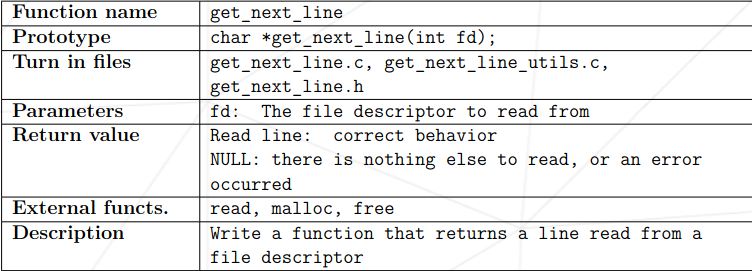

# Get_Next_Line

## Description

In this project, we need to write a function that reads 1 line on single call by using the file descriptors. Even if the buffer size  changes, only one line should be taken in each call. In the use of large buffer sizes, there should be no missing lines.

## Features

